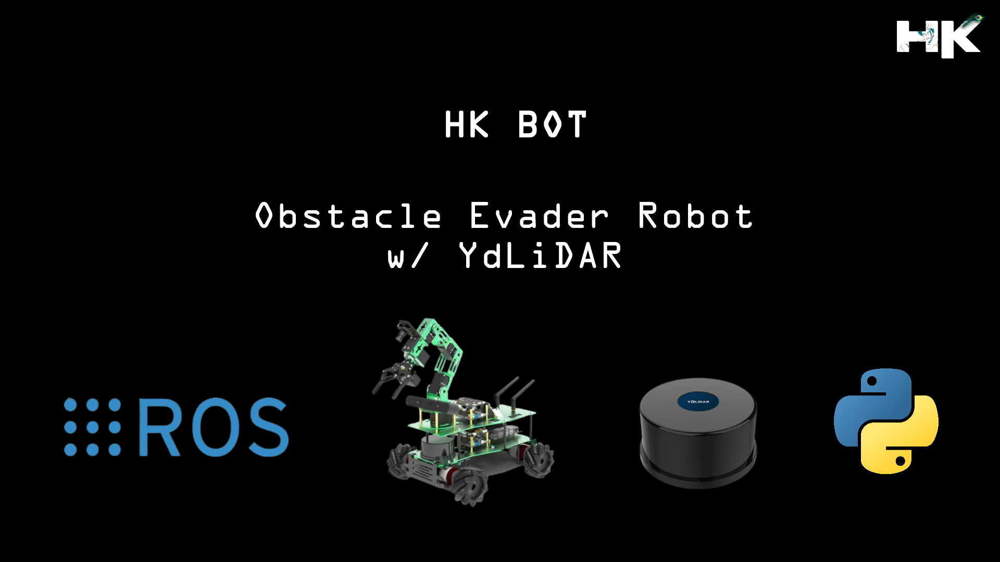
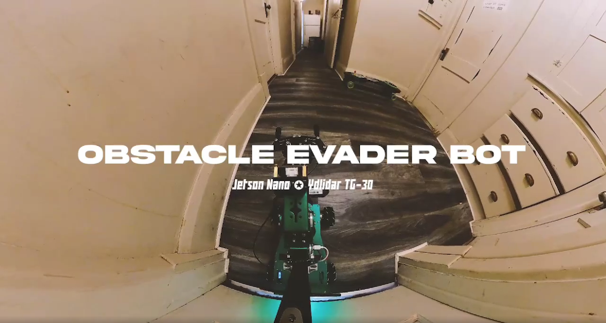
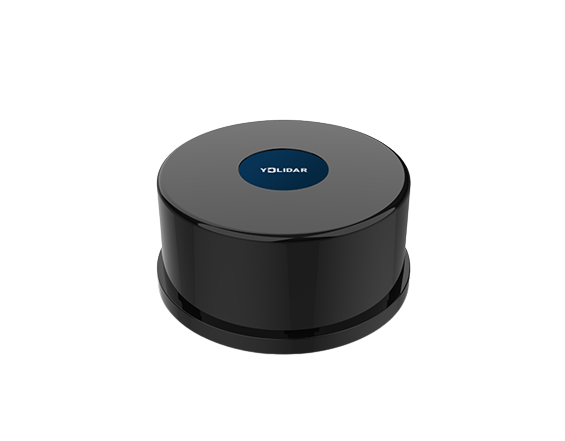
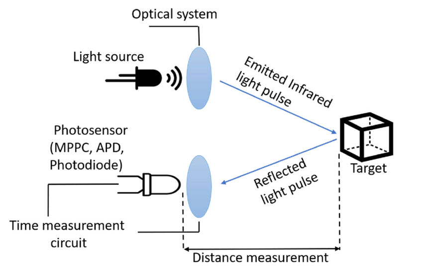
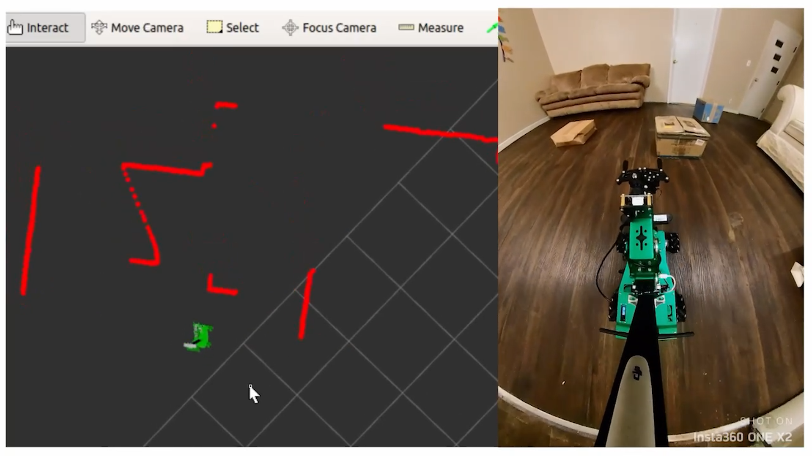
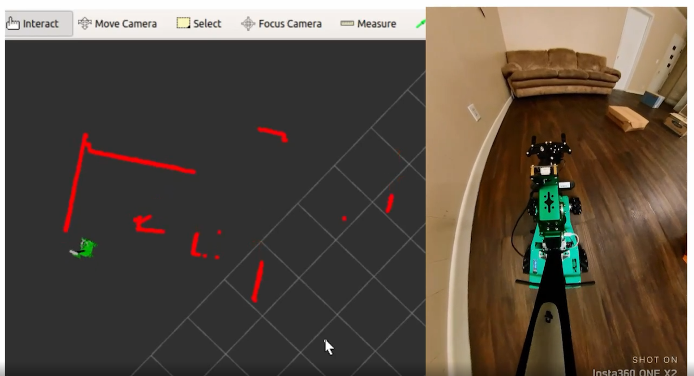

# Obstacle Evader Mobile Robot

  

---------------------------------------------

## About this Project:
This project showcases the HK Bot, an innovative robotic system engineered for autonomous navigation and proficient obstacle avoidance. It incorporates YdLiDAR technology for high-precision environmental scanning and leverages the Robot Operating System (ROS) to offer a sturdy and adaptable platform for robot programming. Python is employed to provide scripting and automation capabilities, further augmenting the bot's intelligent operational functions in various environments. 

Furthermore, the system's spatial data and sensor inputs are visualized using rviz, ROS's 3D visualization tool, allowing for the plotting of 2D LiDAR points for a comprehensive understanding of the robot's perception and navigation capabilities.

  

---------------------------------------------

## What is YdLidar:
YdLiDAR is a type of Light Detection and Ranging (LiDAR) sensor designed for use in robotics and automation. LiDAR sensors measure distances by illuminating targets with laser light and measuring the reflection with a sensor. YdLiDAR sensors are known for their cost-effectiveness and compact size, making them suitable for applications like obstacle avoidance, area mapping, and robot navigation where precise distance measurements and environmental awareness are crucial. 

These sensors can rapidly scan their surroundings to create real-time maps that robots use for path planning and obstacle avoidance, playing a critical role in the field of robotics.

  

---------------------------------------------

## How Does Lidar Work:
TOF (Time of Flight) LiDAR is a technology that calculates the distance to a target by measuring the travel time of a light pulse. The process begins when a laser transmitter emits a beam of modulated light. This light travels to the target, bounces back, and is then detected by the laser receiver in the LiDAR system.

The core of TOF LiDAR's functionality lies in its ability to discern the phase difference between the light sent out and the light that returns. By accurately measuring this phase shift, the system can calculate the precise distance to the object with remarkable accuracy, making TOF LiDAR an essential tool for detailed spatial measurements and mapping.

  

---------------------------------------------

## Results:

  

---------------------------------------------

  

---------------------------------------------

## My Project Video Demonstration:

  
  

---------------------------------------------
